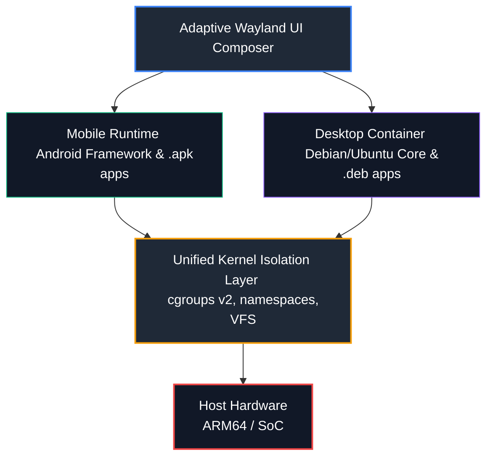

# ARMOS Architecture (Conceptual Reference & PoC)

An open-source **Architectural Reference** and **Proof-of-Concept (PoC)** for **ARMOS**, a unified, hybrid operating system environment designed for foldable hardware. 

The core mission of **ARMOS** is to demonstrate the technical feasibility of running native mobile (`.apk`) and desktop Linux (`.deb`) runtimes concurrently under a **single, shared Linux Kernel**, without binary translation or virtualization overhead, while maintaining the host system's strict security baselines.

---

## 💡 The Core Vision

Modern ARM64 SoCs possess desktop-class computing power, yet mobile operating systems artificially restrict user autonomy and productivity. Conversely, traditional desktop environments lack the interface fluidity, power management, and sensor integration required for mobile hardware.

**ARMOS** breaks this wall by proposing a system that is unified on the inside and adaptive on the outside:
*   **No Dual-Boot or Emulation:** Native execution of both mobile and desktop runtimes directly on the `arm64` CPU.
*   **Adaptive Liquid UI:** A single user session that dynamically transitions from a touch-focused mobile layout to a multi-window desktop workstation based on the folding state of the hardware.
*   **Unified Data Persistence:** A single file explorer orchestrating data transparently, bypassing storage fragmentation.

---

## 🏗️ Architectural Blueprint

### 1. Execution & Resource Isolation (`cgroups v2` & `namespaces`)
Instead of heavy Virtual Machines, isolation is enforced at the kernel level using Linux primitives:
*   **Namespaces (PID, Mount, Net, IPC):** Isolates the desktop user-space from the critical mobile framework, preventing unauthorized inter-process sniffing.
*   **cgroups v2:** Imposes strict, deterministic resource ceilings (RAM/CPU memory limits) on the desktop subsystem. This ensures the mobile telephony stack and UI interaction loop maintain highest priority execution (`nice` scheduling), preventing desktop workloads from causing system-wide UI latency.

### 2. VFS Storage Orchestration & Execution Router
*   **Bind Mounts & VFS:** The root filesystems (`/`) remain securely isolated. However, user data directories (`/Downloads`, `/Workspace`) are mapped dynamically using selective Kernel bind mounts. 
*   **MIME-Type Routing:** The ARMOS file manager intercepts binary package executions. By reading file signatures, it dispatches the installation/execution to the correct subsystem natively (`PackageManager` for APKs or a contained `dpkg/apt` environment for DEBs).

---

## ⚠️ Known Technical Challenges & Research Boundary

This repository functions as an **Academic Research Architecture** (developed as part of a Computer Science Bachelor Thesis). It explicitly maps out the engineering boundaries that prevent third-party consumer deployment, aiming instead to serve as a reference for native industry adoption (e.g., Google, Samsung):

*   **Binder IPC Isolation:** Standard Android relies heavily on the Binder driver for framework communication, which is historically difficult to isolate safely across distinct non-Android namespaces without reference leakage.
*   **GPU Contention (DRM-KMS):** Preventing priority inversion when both subsystems request hardware-accelerated rendering from partially proprietary GPU drivers (e.g., Qualcomm Adreno).
*   **SafetyNet / Play Integrity Coexistence:** Mapping the hardware-backed attestation (TEE/TrustZone) requirements needed to keep critical financial mobile applications secure while maintaining an open terminal shell environment within the desktop container.

---

## 🛠️ PoC Stack & Simulation Environment

The experimental Proof-of-Concept is designed to run in hardware-constrained setups (simulated environments with **8GB RAM / 16GB Host PC**), testing individual modules sequentially:

*   **Subsystem Virtualization:** Leveraging customized **LXC** containers and concepts derived from **Waydroid** to achieve shared-kernel desktop rendering.
*   **Storage Prototyping:** Utilizing sandboxed **PRoot/Chroot** environments within **Termux** hooks to validate the MIME-Type automated file routing logic.
*   **Display Compositing:** Testing fluid window resizing variables via the **Wayland** protocol and `wlroots` ecosystem.

---

## 📄 License

This architectural specification and its PoC implementations are licensed under the **GNU GPLv3**. Copyleft provisions ensure that any downstream integration or modification by third parties or industry vendors must remain entirely open-source, preserving the developer community's collaborative access.
